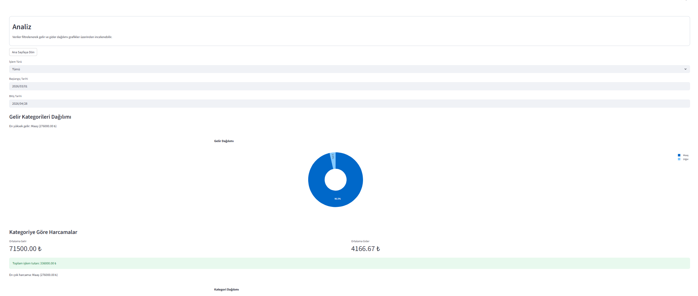
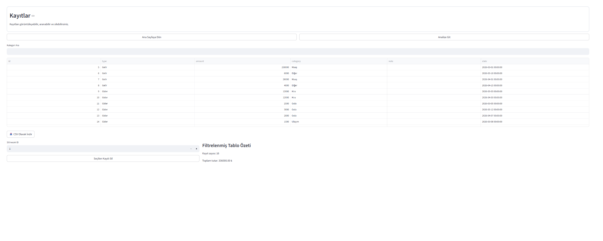

# 📊 Kişisel Finans Yönetimi Uygulaması

Bu proje, kullanıcıların gelir ve giderlerini kaydedip analiz edebileceği basit bir finans takip uygulamasıdır.  
Uygulama Streamlit kullanılarak geliştirilmiş olup, veriler SQLite veritabanında saklanmaktadır.

---

## 🎯 Proje Amacı

- Gelir ve giderlerin düzenli takibini sağlamak  
- Finansal durumun analiz edilmesini kolaylaştırmak  
- Grafikler ile kullanıcıya görsel bir deneyim sunmak  

---

## 🚀 Özellikler

- ➕ Gelir ve gider ekleme  
- 📋 Kayıtları görüntüleme ve silme  
- 📊 Grafiklerle analiz  
- 🔍 Tarih ve işlem türüne göre filtreleme  
- 💾 CSV olarak veri indirme  
- 📈 Aylık gelir-gider takibi  

---

## 🛠 Kullanılan Teknolojiler

- Python  
- Streamlit  
- SQLite  
- Pandas  
- Plotly  

---

## 📸 Ekran Görüntüleri

### 🏠 Ana Sayfa


### ➕ İşlem Ekle


### 📋 Veri Listesi


### 📊 Analiz Sayfası



### 🔍 Filtreleme


---

## ⚙️ Kurulum ve Çalıştırma

```bash
pip install -r requirements.txt
streamlit run app.py

👤 Geliştirici

Uygar Kutluğ
